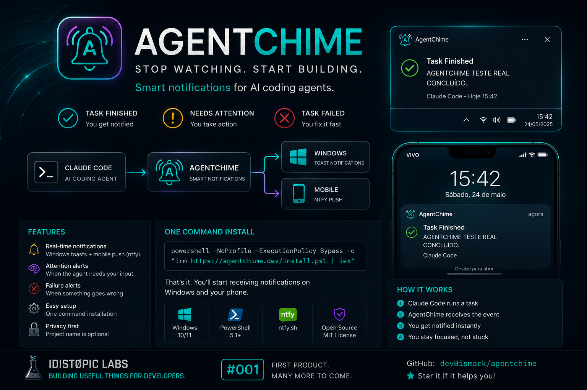

<p align="center">
  
</p>

<h1 align="center">AgentChime</h1>

<p align="center">
  <strong>Stop watching your terminal.</strong><br />
  Windows + mobile notifications when your AI coding agent finishes, needs attention, or fails.
</p>

<p align="center">
  <a href="https://github.com/devBismark/agentchime/releases/tag/v0.1.0"></a>
  <a href="https://github.com/devBismark/agentchime/actions/workflows/powershell.yml"></a>
  <a href="LICENSE"></a>
  
  
</p>

<p align="center">
  <a href="#quick-start">Quick start</a> ·
  <a href="#how-it-works">How it works</a> ·
  <a href="#mobile-notifications">Mobile</a> ·
  <a href="#privacy-first">Privacy</a> ·
  <a href="#commands">Commands</a> ·
  <a href="docs/ROADMAP.md">Roadmap</a>
</p>

---

## The problem

AI coding agents can work for minutes — sometimes much longer. The annoying part is not the wait itself; it is repeatedly checking the terminal to see whether the agent finished, failed, or is waiting for you.

**AgentChime makes the agent call you back.**

```text
Claude Code
     │
     ├── finished ────────────────┐
     ├── needs attention ─────────┼──> AgentChime ──> Windows notification
     └── API / model failure ─────┘              └──> Mobile push (optional)
```

Built from a real workflow annoyance, validated on Windows with Claude Code, then packaged as an open-source microtool.

---

## What you get

| | Capability | What it means |
|---|---|---|
| ✅ | **Task finished** | Get notified as soon as Claude finishes the turn. |
| ⚠️ | **Needs attention** | Know when Claude needs permission or input. |
| ❌ | **Task failed** | Get an alert when the turn stops because of an API/model/service failure. |
| 🖥️ | **Native Windows alerts** | Desktop notification + sound, no extra notification framework required. |
| 📱 | **Optional mobile push** | Receive the same status on your phone through ntfy. |
| 🔒 | **Privacy first** | No prompt, source code, secrets, or Claude response is sent to mobile. |
| 🧰 | **No runtime stack** | No Python, Node.js, npm package, or PowerShell module required. |
| 🩺 | **Built-in diagnostics** | `doctor`, `status`, test commands, backups, and safe uninstall. |

---

## Quick start

### Windows only

Open PowerShell and run:

```powershell
powershell.exe -NoProfile -ExecutionPolicy Bypass -Command "$s=(Invoke-RestMethod 'https://raw.githubusercontent.com/devBismark/agentchime/main/bootstrap.ps1'); & ([ScriptBlock]::Create([string]$s))"
```

### Windows + mobile notifications

```powershell
powershell.exe -NoProfile -ExecutionPolicy Bypass -Command "$s=(Invoke-RestMethod 'https://raw.githubusercontent.com/devBismark/agentchime/main/bootstrap.ps1'); & ([ScriptBlock]::Create([string]$s)) -EnableMobile"
```

### Windows + mobile + Portuguese

```powershell
powershell.exe -NoProfile -ExecutionPolicy Bypass -Command "$s=(Invoke-RestMethod 'https://raw.githubusercontent.com/devBismark/agentchime/main/bootstrap.ps1'); & ([ScriptBlock]::Create([string]$s)) -EnableMobile -Locale pt-BR"
```

> AgentChime's PowerShell scripts are currently unsigned. `ExecutionPolicy Bypass` above applies only to that installer process; it does **not** permanently change your Windows execution policy.

After installation, open a **new Claude Code session**. That is it.

---

## How it works

AgentChime registers global Claude Code lifecycle hooks in:

```text
~/.claude/settings.json
```

Those hooks call the notifier installed at:

```text
~/.agentchime/notify.ps1
```

| AgentChime state | Claude Code hook | Trigger |
|---|---|---|
| `finished` | `Stop` | Claude finishes the turn normally. |
| `attention` | `Notification` | Claude needs permission, background input, or MCP elicitation. |
| `error` | `StopFailure` | The turn stops because of an API/model/service failure. |

AgentChime intentionally does **not** map `idle_prompt` to the attention state. `Stop` already sends the completion alert, and mapping both can create a delayed duplicate notification.

Existing unrelated Claude hooks are preserved. AgentChime also backs up Claude settings before modifying them and avoids duplicate AgentChime handlers on reinstall.

---

## Verify your installation

From the AgentChime repository folder:

```powershell
.\agentchime.ps1 doctor
```

Expected result:

```text
AgentChime doctor
[OK] notify.ps1 installed
[OK] config.json readable
[OK] Claude hooks reference AgentChime exactly once (Stop, StopFailure, Notification)
[OK] ntfy server healthy
Doctor result: PASS
```

Test each state manually:

```powershell
.\agentchime.ps1 test finished
.\agentchime.ps1 test attention
.\agentchime.ps1 test error
```

For a true end-to-end test, open a new Claude Code session, send a short request, and leave the terminal. AgentChime should notify you when Claude finishes.

You can also inspect Claude's registered hooks with:

```text
/hooks
```

---

## Mobile notifications

AgentChime uses [ntfy](https://ntfy.sh/) for optional mobile push. The ntfy CLI is **not** required.

1. Install the ntfy app on Android or iOS.
2. Install AgentChime with `-EnableMobile`.
3. The installer prints a long random topic.
4. Subscribe to that **exact** topic in the ntfy app.
5. Run:

```powershell
.\agentchime.ps1 test finished
```

To inspect your current mobile configuration:

```powershell
.\agentchime.ps1 mobile
```

If desktop notifications work but mobile does not, compare the topic shown by AgentChime with the topic in the ntfy app **character by character**.

More details: [Mobile guide](docs/MOBILE.md) · [Troubleshooting](docs/TROUBLESHOOTING.md)

---

## Privacy first

When using public `ntfy.sh`, AgentChime sends only minimal status context:

**May be sent**

- completion / attention / error state
- current project folder name, if enabled
- generic notification text
- API error type when available

**Never sent by AgentChime**

- your prompt
- source code
- secrets
- Claude's response

A random ntfy topic is convenient but is not the same as authenticated access control. For sensitive environments, use authenticated/self-hosted ntfy or disable mobile notifications.

Read the full [privacy notes](docs/PRIVACY.md).

---

## Commands

```powershell
.\agentchime.ps1 status
.\agentchime.ps1 doctor
.\agentchime.ps1 mobile
.\agentchime.ps1 test finished
.\agentchime.ps1 test attention
.\agentchime.ps1 test error
```

### Local / reviewed installation

If you prefer to inspect the code before running it:

```powershell
git clone https://github.com/devBismark/agentchime.git
cd agentchime
powershell.exe -NoProfile -ExecutionPolicy Bypass -File .\install.ps1
```

With mobile:

```powershell
powershell.exe -NoProfile -ExecutionPolicy Bypass -File .\install.ps1 -EnableMobile
```

With mobile in Brazilian Portuguese:

```powershell
powershell.exe -NoProfile -ExecutionPolicy Bypass -File .\install.ps1 -EnableMobile -Locale pt-BR
```

### Keep an existing ntfy topic

```powershell
powershell.exe -NoProfile -ExecutionPolicy Bypass -File .\install.ps1 -EnableMobile -NtfyTopic "your-existing-topic"
```

### Disable mobile

```powershell
powershell.exe -NoProfile -ExecutionPolicy Bypass -File .\install.ps1 -DisableMobile
```

Reinstalling without mobile or locale flags preserves the current AgentChime configuration.

---

## Installed files

```text
~/.agentchime/
├── config.json
├── notify.ps1
├── agentchime.log       # created only if an alert fails
└── backups/
    └── settings-*.json
```

AgentChime only modifies its own handler entries inside:

```text
~/.claude/settings.json
```

---

## Uninstall

```powershell
powershell.exe -NoProfile -ExecutionPolicy Bypass -File .\uninstall.ps1
```

Keep your configuration and backups:

```powershell
powershell.exe -NoProfile -ExecutionPolicy Bypass -File .\uninstall.ps1 -KeepConfig
```

The uninstaller backs up Claude settings first and removes only handlers pointing to AgentChime.

---

## Roadmap

- [x] Windows desktop notifications
- [x] Claude Code completion alerts
- [x] attention alerts
- [x] API / model failure alerts
- [x] ntfy mobile notifications
- [x] safe migration + idempotent installer
- [x] diagnostics + safe uninstall
- [x] one-command remote bootstrap
- [ ] elapsed task / turn duration
- [ ] richer project context
- [ ] first-class `agentchime` command on PATH
- [ ] Codex adapter
- [ ] additional AI coding agents
- [ ] more mobile providers
- [ ] signed / reproducible release artifacts

See the full [roadmap](docs/ROADMAP.md).

---

## IDISTØPIC LABS · #001

AgentChime is the first public microtool from **IDISTØPIC LABS** — a space for small, practical open-source tools born from real friction in AI, automation, and software development.

> **Small tools. Real problems. Open source.**

If AgentChime saves you a few terminal checks, consider giving the repository a ⭐. It helps other developers find it.

---

## Contributing

Issues, ideas, bug reports, and pull requests are welcome.

- [Contribution guide](CONTRIBUTING.md)
- [Security policy](SECURITY.md)
- [Changelog](CHANGELOG.md)

## Disclaimer

AgentChime is an independent open-source project. It is not affiliated with or endorsed by Anthropic. Claude and Claude Code are trademarks of their respective owner.

## License

MIT — see [LICENSE](LICENSE).
